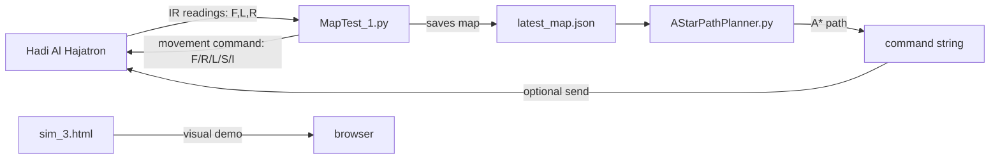
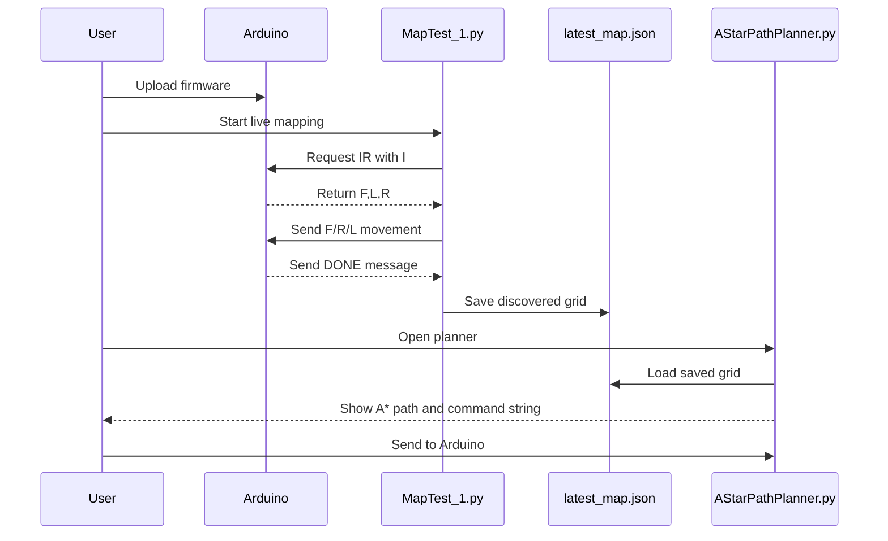

# Hadi Al Hajatron


**A Python + Arduino grid-based navigation robot with live frontier exploration, IR obstacle sensing, encoder-based movement, saved map output, and A* path planning.**

Hadi Al Hajatron connects a desktop Python GUI to an Arduino-powered navigation robot. It explores a 4x4 grid, reads front/left/right IR sensors, marks free and blocked cells, saves the discovered map, and then uses A* to plan a route through the explored world.

## Highlights

| Feature | What It Does |
| --- | --- |
| Live mapping GUI | Shows the robot, heading, IR readings, frontier cells, and planned path in real time. |
| Arduino motor firmware | Drives forward moves and 90 degree turns using encoder counts. |
| IR obstacle sensing | Reads front, left, and right sensors through a simple serial request. |
| Frontier-based exploration | Chooses the nearest unknown frontier next to known free space. |
| A* route planner | Loads the saved map, lets you choose start/goal cells, and creates Arduino commands. |
| Browser simulation | Provides a standalone HTML mapping visualization demo. |

## Repository Layout

```text
Hadi-Al-Hajatron/
|-- AStarPathPlanner.py        # Tkinter A* path planner and command sender
|-- MapTest_1.py               # Live robot mapping GUI
|-- MasterMotorControl_IR.ino  # Arduino motor, encoder, IR, and serial firmware
|-- latest_map.json            # Saved mapping output
|-- sim_3.html                 # Standalone browser simulation
|-- .gitignore                 # Python cache ignore rules
`-- README.md                  # Project documentation
```

## System Flow



## Hardware

The Arduino sketch expects the Hadi Al Hajatron hardware to include:

- Two DC motors connected through a PWM motor driver.
- Left and right wheel encoders.
- Three IR obstacle sensors: front, left, and right.
- USB serial connection to the Windows laptop.

### Pin Map

| Group | Signal | Arduino Pin |
| --- | --- | --- |
| Left motor | `L_RPWM` | 5 |
| Left motor | `L_LPWM` | 6 |
| Right motor | `R_RPWM` | 10 |
| Right motor | `R_LPWM` | 11 |
| Left encoder | `ENC_L_A` | 2 |
| Left encoder | `ENC_L_B` | 4 |
| Right encoder | `ENC_R_A` | 3 |
| Right encoder | `ENC_R_B` | 7 |
| IR sensor | Front | 9 |
| IR sensor | Left | 8 |
| IR sensor | Right | 12 |

IR sensors are configured as digital sensors by default:

```cpp
const bool IR_USE_ANALOG = false;
const bool IR_OBSTACLE_IS_LOW = true;
```

IR values use this convention:

| Value | Meaning |
| --- | --- |
| `0` | Obstacle detected |
| `1` | Free space |

## Arduino Serial Protocol

Baud rate: `115200`

| Command | Meaning |
| --- | --- |
| `F` | Move forward by `FORWARD_DISTANCE_CM`. |
| `R` | Turn right 90 degrees. |
| `L` | Turn left 90 degrees. |
| `S` | Emergency stop and clear the command queue. |
| `I` | Return IR readings as `front,left,right`. |

The Arduino accepts uppercase or lowercase commands and can queue combined strings:

```text
FRFFL
```

Movement completion is reported with messages like:

```text
DONE: Forward 60.00 cm
DONE: Right 90 degree
DONE: Left 90 degree
```

`MapTest_1.py` waits for `DONE:` before updating the robot position and requesting the next IR reading.

## Calibration

Current encoder calibration:

```cpp
const float FORWARD_DISTANCE_CM = 60.0;
const long LEFT_TARGET_60CM  = 2232;
const long RIGHT_TARGET_60CM = 2175;
const long LEFT_TURN_90  = 734;
const long RIGHT_TURN_90 = 719;
```

Only change `FORWARD_DISTANCE_CM` for a different step size. Keep the encoder constants unchanged unless the robot is recalibrated.

## Requirements

| Tool | Purpose |
| --- | --- |
| Python 3 | Runs the mapping and planner GUIs. |
| Tkinter | Desktop GUI framework included with most Python installs. |
| pyserial | Serial communication between Python and Arduino. |
| Arduino IDE | Uploads `MasterMotorControl_IR.ino` to the board. |

Install Python dependency:

```powershell
pip install pyserial
```

## Quick Start

### 1. Upload Arduino Firmware

1. Open `MasterMotorControl_IR.ino` in Arduino IDE.
2. Select the correct board and COM port.
3. Upload the sketch.
4. Close Arduino Serial Monitor and Serial Plotter.
5. Keep the Arduino connected over USB.

### 2. Run Live Mapping

```powershell
cd "C:\Users\moham\OneDrive\Desktop\MapTestCode"
python MapTest_1.py
```

The mapper:

1. Connects to the Arduino.
2. Requests IR readings with `I`.
3. Updates free and obstacle cells.
4. Finds frontier cells.
5. Plans the next step with A*.
6. Sends one command at a time.
7. Waits for Arduino `DONE:` messages.
8. Saves the final map to `latest_map.json`.

### 3. Run A* Planner

```powershell
python AStarPathPlanner.py
```

The planner:

- Loads `latest_map.json`.
- Uses the saved robot position as the default start.
- Uses `(3, 3)` as the default goal when it is free.
- Lets you click cells to change start or goal.
- Converts the path into Arduino commands.
- Sends the command string to the Arduino when requested.

Example output:

```text
Command array: ['forward', 'right', 'forward']
Arduino command string: FRF
```

### 4. Open Browser Simulation

Open this file directly in a browser:

```text
sim_3.html
```

No server, Python process, or Arduino is required for the simulation.

## Map Format

`latest_map.json` stores the map, final robot position, and final heading:

```json
{
  "grid": [
    [0, 0, 1, 0],
    [0, 1, 0, 0],
    [0, 0, 0, 0],
    [1, 0, 0, 1]
  ],
  "bot_position": {
    "x": 3,
    "y": 2
  },
  "bot_heading": 2,
  "bot_heading_name": "South"
}
```

Grid values:

| Value | Meaning |
| --- | --- |
| `0` | Free or unknown in the exported planner map |
| `1` | Obstacle |

Coordinates use `(x, y)`, where `x` is the column, `y` is the row, and `(0, 0)` is the top-left cell.

## GUI Legend

### Live Mapper

| Visual | Meaning |
| --- | --- |
| Gray cell | Unknown |
| Green cell | Free |
| Red cell | Obstacle |
| Blue circle | Robot |
| White arrow | Robot heading |
| Blue `F` outline | Frontier |
| Yellow path | Current planned route |

### A* Planner

| Visual | Meaning |
| --- | --- |
| Green cell | Free |
| Red cell | Obstacle |
| Yellow cell | Planned path |
| `S` marker | Start |
| `G` marker | Goal |

## Heading Values

| Value | Heading |
| --- | --- |
| `0` | North |
| `1` | East |
| `2` | South |
| `3` | West |

## Recommended Workflow



## Troubleshooting

| Problem | Fix |
| --- | --- |
| `pyserial is not installed` | Run `pip install pyserial`. |
| No serial ports found | Check USB cable, Arduino power, board drivers, and Device Manager. |
| `Access is denied` on COM port | Close Arduino Serial Monitor, Serial Plotter, and other Python windows. |
| Robot drives incorrectly | Check motor wiring, encoder wiring, battery voltage, and calibration constants. |
| IR readings look reversed | Check `IR_OBSTACLE_IS_LOW` in the Arduino sketch. |
| Planner says no path found | Choose a free start and goal cell, and confirm obstacles are correct in `latest_map.json`. |

## Repository

GitHub:

```text
https://github.com/mohammednafees1007-hub/Hadi-Al-Hajatron
```

Useful commands:

```powershell
git status
git add README.md
git commit -m "Polish project README"
git push
```
