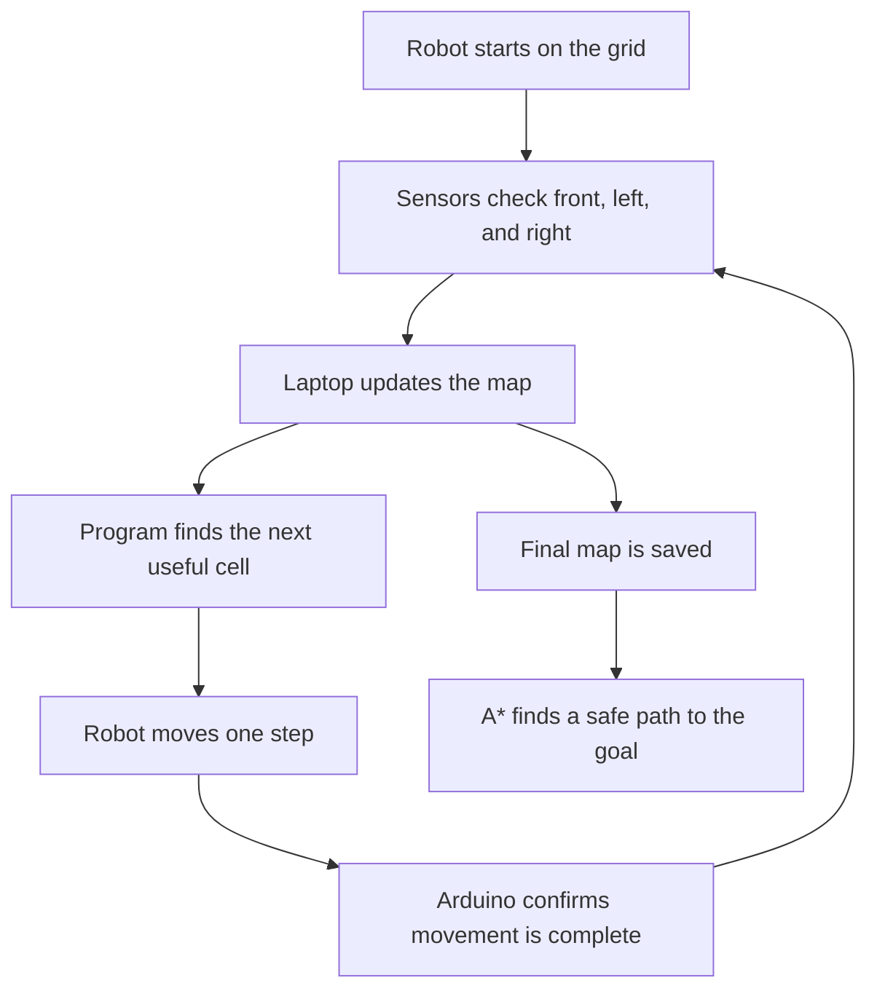

# Hadi Al Hajatron: Simple Explanation

## What Is This Project?

**Hadi Al Hajatron** is a small robot that can move around a square grid, understand where obstacles are, make a map, and then choose a path to reach a target.

Think of it like a mini delivery robot in a room. It does not know the room at first. It moves step by step, checks what is around it, remembers blocked places, and slowly builds a map.

## The Big Idea

The robot answers three simple questions:

1. **Where am I?**
2. **What is around me?**
3. **What is the best way to move next?**

It uses sensors to detect obstacles, motors to move, and a computer program to decide the next step.

## What The Robot Does

The robot:

- Starts on a grid.
- Checks the front, left, and right sides using IR sensors.
- Marks blocked areas as obstacles.
- Marks safe areas as free cells.
- Shows the map live on a laptop screen.
- Plans where to go next.
- Finds the shortest safe path using the A* algorithm.
- Sends movement commands to the robot.

## Simple Real-Life Example

Imagine the grid is a room:

```text
[ Start ] [ Empty ] [ Block ]
[ Empty ] [ Block ] [ Empty ]
[ Empty ] [ Empty ] [ Goal  ]
```

The robot should not hit the blocked cells. So it checks the area, builds a map, and then chooses a safe path from `Start` to `Goal`.

## Main Parts Of The Project

| Part | Simple Meaning |
| --- | --- |
| Robot body | The physical bot that moves on the floor. |
| Arduino | The small controller that drives motors and reads sensors. |
| Motors | The parts that move the wheels. |
| Encoders | Help measure how far the wheels moved. |
| IR sensors | Detect whether something is in front, left, or right. |
| Python GUI | The laptop screen that shows the live map. |
| A* algorithm | The path-finding method that finds a good route. |

## How It Works Step By Step



## What You See On The Laptop

The Python program shows a grid:

| Color / Symbol | Meaning |
| --- | --- |
| Gray | Unknown area |
| Green | Safe/free area |
| Red | Obstacle |
| Blue circle | Robot position |
| Arrow | Robot direction |
| Yellow line | Planned path |

## What Is A* Path Planning?

A* is a smart path-finding method.

It helps the robot choose a path that:

- Avoids obstacles.
- Does not waste extra movement.
- Reaches the goal efficiently.

In simple words: **A* helps the robot find a safe shortcut.**

## Why This Project Is Useful

This project shows the basic ideas behind real autonomous robots.

Similar ideas are used in:

- Warehouse robots
- Delivery robots
- Cleaning robots
- Search and rescue robots
- Automated guided vehicles

## What We Built

We built:

- A real moving robot.
- Arduino code for motors and sensors.
- Python software for live mapping.
- A path planner using A*.
- A saved map file.
- A browser simulation.
- A public project report.

## Demo Videos

- [FBE mapping and A* path output](https://drive.google.com/file/d/1guCm4QYnMYOHiRjrAKDh5w8sXYH0lnsS/view?usp=sharing)
- [Project simulation video](https://drive.google.com/file/d/1iZEhApimRnLMOh4Wx2o7xYoT5nfrdVpN/view?usp=sharing)

## Project Members

- Mohammed Nafees H
- Harishankar B S
- G.SSS Hansika

## One-Line Summary

**Hadi Al Hajatron is a small robot that explores a grid, detects obstacles, creates a map, and finds a safe path using Python and Arduino.**
